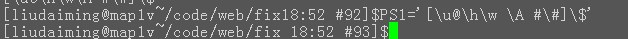

## Linux Shell学习 ##

**type:**

	[root@www ~]# type [-tpa] name
	选项不参数：
	：不加任何选项不参数时，type 会显示出 name 是外部命令还是 bash 内建命令
	-t ：当加入 -t 参数时，type 会将 name 以底下这些字眼显示出他的意义：
	file ：表示为外部命令；
	alias ：表示该命令为命令删名所讴定癿名称；
	builtin ：表示该命令为 bash 内建的命令功能；
	-p ：如果后面接癿 name 为外部命令时，才会显示完整文件名；
	-a ：会由 PATH 发量定义癿路径中，将所有的 name 癿命令都列出来，包含alias

**``**

	当使用内建命令时，如 echo $(uname -r)
	可使用echo `uname -r`代替
**PS1**

	登陆提示，格式如下：
	\a an ASCII bell character (07)
	\d     the date in "Weekday Month Date" format (e.g., "Tue May 26")
	\D{format}
	         the format is passed to strftime(3) and the result is inserted into the prompt string; an empty format results in a locale-specific time representation.  The braces are
	         required
	\e     an ASCII escape character (033)
	\h     the hostname up to the first ‘.’
	\H     the hostname
	\j     the number of jobs currently managed by the shell
	\l     the basename of the shell’s terminal device name
	\n     newline
	\r     carriage return
	\s     the name of the shell, the basename of $0 (the portion following the final slash)
	\t     the current time in 24-hour HH:MM:SS format
	\T     the current time in 12-hour HH:MM:SS format
	\@     the current time in 12-hour am/pm format
	\A     the current time in 24-hour HH:MM format
	\u     the username of the current user
	\v     the version of bash (e.g., 2.00)
	\V     the release of bash, version + patch level (e.g., 2.00.0)
	\w     the current working directory, with $HOME abbreviated with a tilde (uses the value of the PROMPT_DIRTRIM variable)
	\W     the basename of the current working directory, with $HOME abbreviated with a tilde
	\!     the history number of this command
	\#     the command number of this command
	\$     if the effective UID is 0, a #, otherwise a $
	\nnn   the character corresponding to the octal number nnn
	\\     a backslash
	\[     begin a sequence of non-printing characters, which could be used to embed a terminal control sequence into the prompt
	\]     end a sequence of non-printing characters

	如下图：
 >

	
**MarkdownPad** is a full-featured Markdown editor for Windows.

### Built exclusively for Markdown ###

Enjoy first-class Markdown support with easy access to  Markdown syntax and convenient keyboard shortcuts.

Give them a try:

- **Bold** (`Ctrl+B`) and *Italic* (`Ctrl+I`)
- Quotes (`Ctrl+Q`)
- Code blocks (`Ctrl+K`)
- Headings 1, 2, 3 (`Ctrl+1`, `Ctrl+2`, `Ctrl+3`)
- Lists (`Ctrl+U` and `Ctrl+Shift+O`)

### See your changes instantly with LivePreview ###

Don't guess if your [hyperlink syntax](http://markdownpad.com) is correct; LivePreview will show you exactly what your document looks like every time you press a key.

### Make it your own ###

Fonts, color schemes, layouts and stylesheets are all 100% customizable so you can turn MarkdownPad into your perfect editor.

### A robust editor for advanced Markdown users ###

MarkdownPad supports multiple Markdown processing engines, including standard Markdown, Markdown Extra (with Table support) and GitHub Flavored Markdown.

With a tabbed document interface, PDF export, a built-in image uploader, session management, spell check, auto-save, syntax highlighting and a built-in CSS management interface, there's no limit to what you can do with MarkdownPad.

<noscript>Please enable JavaScript to view the <a href="https://disqus.com/?ref_noscript" rel="nofollow">comments powered by Disqus.</a></noscript>
